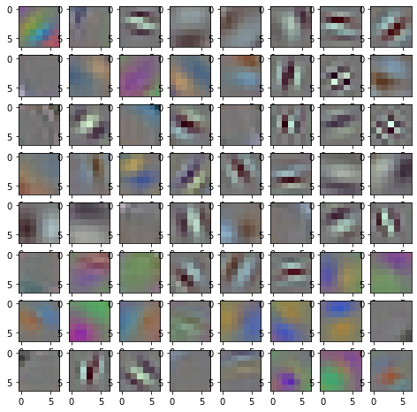
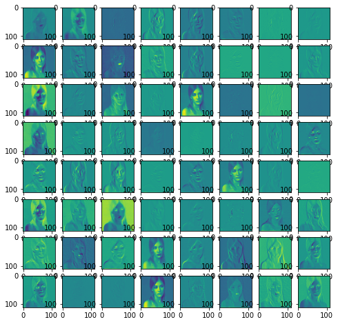

# Intel(r) OpenVINO(tm) IR model utility tool
This is a utility tool for OpenVINO IR model file. This tool has following functions:

Update on 02-APR-2022 : Add IRv11 and OpenVINO 2022.1 API2.0 Support.

1. Display IR model summary information (`ir-summary.py`)  
  Displays IR version, Input/Output blob names and shapes

2. Weight data extraction (`ir_weight_extractor.py`)  
  Extract weight data from an IR model and ganerates a pickle file

3. Extract the feature map (intermediate buffer between layers) from an IR model (`ir_featuremap_extractor.py`)  
  Run an IR model and extract the feature map data of all layers and generates a pickle file

4. Compare the feature map data files (`compare_feature_maps.py`)  
  Compare two feature map files and check the difference. This tool might be helpful for finding a problem point in accuracy problem between different type of OpenVINO plugins.  

5. Calculate individual output blob size of an OpenVINO IR model (`ir_output_blob_size_calculator.py`)  
  The tool calculates the output blob size of layers in an IR model and summarize it. You can use it to identify the memory hungry layers in the model.  


OpenVINOのIRモデル用のユーティリティーツールプログラムです。このツールは下記の機能を持っています。
1. IRモデルのサマリー情報表示 (`ir-summary.py`)  
  IRバージョン、input / output blob名、shape
2. IRモデルの重みデータ抜き出し  (`ir_weight_extractor.py`)  
　重みデータを抜き出し、Python pickleファイルを作成します
3. 特徴マップデータ抜き取り (`ir_featuremap_extractor.py`)  
　IRモデルを実行しながら中間バッファから特徴マップデータを抜き出し、Python pickleファイルを作成します
4. 特徴マップデータ比較ツール (`compare_feature_maps.py`)  
  ２つの特徴マップデータを比較し差異を表示。異なるOpenVINOプラグイン間での精度問題のチェックなどに使えるかもしれない。
5. IRモデル中のレイヤーごとのoutput blobのサイズとそのトータルを求める (`ir_output_blob_sie_calculator.py`)  
  モデル内のどのレイヤーがメモリを多く使うのかなどの調査に利用可能

## How to Run

All tool are Python scripts. Just run them.

1. `ir-summary.py`  
*Options:*  
    `-m`, `--model` : Input IR model path  
    `-d`, `--dir`   : Input IR model directory  

2. `ir_weight_extractor.py`  
  `model_wgt.pickle` file will be generated *at the same directory as the input model* when the input model file name is `model.xml`.  
*Options:*  
    `-m`, `--model` : Input IR model path  
*Output pickle file format:*  
Dictionary `{ blobName0 : [ precStr0, shape0, weightBuf0 ], blobName1 : [ precStr1, shape1, weightBuf1 ], ... }`  precStr='FP32', 'FP16', 'I32', ...

3. `ir_featuremap_extractor.py`  
  `model_featmap.pickle` file will be generated at the same directory as the script file when the input model file name is `model.xml`.  
*IMPORTANT NOTICE:*  
This program reads `image.jpg` and supply it to the 1st input blob as default. In case your model requires special input data (multiple input blobs, non-image input, etc), you need to modify `prepareInputs()` function to meet the requirements.  
*Options:*  
    `-m`, `--model` : Input IR model path  
    `-i`, `--input` : Input image file path (default=`image.jpg`)  
*Output pickle file format:*  
Dictionary `{ blobName0 : [ precStr0, shape0, featMap0 ], blobName1 : [ precStr1, shape1, featMap1 ], ... }`  precStr='FP32', 'FP16', 'I32', ...

4. `compare_feature_maps.py`  
 This program takes 2 extracted feature map files generated by `ir_featuremap_extractor.py` and compare them.  
 You may find some hint to resolve accuracy problem of DL models, hopefully :-)  
*Options:*  
  `-r`, `--reference_feature` : input feature map pickle file (.pickle)  
  `-f`, `--feature`           : input feature map pickle file to compare with the reference feature map data (.pickle)  
  `-e`, `--error`             : error tolerance (%). default=10  
  `-v`, `--verbose`           : display error values  
  `-t`, `--top`               : # of error values to display (per layer, with -v option)  

5. `ir_output_blob_size_calculator.py`  
 This program calculates the output blob size of layers in an OpenVINO IR model. The program reads .xml file, parse it and calculate the output blob size. This tool will give you certain level of idea which layer in the model is memory hungry and how much memory might be required to run the model.  
 *Options:*  
  `-m`     : input IR model file name (.xml)

------------------

### Example of visualized weight and feature map which is obtained by `ir_weight_extractor.py` and `ir_featuremap_extractor.py`.  
*Note:* The code to visualize the data is not included in this project.  
**Weight data for convolution**  
  
**Feature map generated by a convolution layer**  
  

## How to read and use Python pickled data
```python
import pickle
with open('foo.pickle', 'rb') as f:
    data = pickle.load(f)     # the pickled data will be loaded to `data`

a = data['conv1']
```

## Examples of command output

### Model summary - single input file (IR version, input / output blob name and shape)
```sh
python ir-summary.py -m ..\..\public\googlenet-v1\FP16\googlenet-v1.xml
Model: ..\..\public\googlenet-v1\FP16\googlenet-v1
IR version:10
Input Blob(s):
  BlobName:data, Shape:[1, 3, 224, 224], Precision:FP32
Output Blob(s):
  BlobName:prob, Shape:[1, 1000], Precision:FP32
```

### Model summary - multiple input files (IR version, input / output blob name and shape)
```sh
> python ir-summary.py -d ..\..\public
Model: ..\..\public\googlenet-v1\FP16\googlenet-v1
IR version:10
Input Blob(s):
  BlobName:data, Shape:[1, 3, 224, 224], Precision:FP32
Output Blob(s):
  BlobName:prob, Shape:[1, 1000], Precision:FP32

Model: ..\..\public\googlenet-v1\FP32\googlenet-v1
IR version:10
Input Blob(s):
  BlobName:data, Shape:[1, 3, 224, 224], Precision:FP32
Output Blob(s):
  BlobName:prob, Shape:[1, 1000], Precision:FP32
  :
```

### IR model weight extraction - `ir_weight_extractor.py`
```sh
python ir_weight_extractor.py -m public\googlenet-v1\FP16\googlenet-v1.xml
*** OpenVINO IR model weight data extractor
    size : nodeName
       6 : data_add_/copy_const
   18816 : 175/Output_0/Data__const
     128 : conv1/7x7_s2/Dims2528/copy_const
       8 : pool1/norm16956/value6958_const
      :
     256 : inception_5b/pool_proj/Dims2558/copy_const
      16 : loss3/classifier/flatten_fc_input/Cast_18765_const
 2048000 : loss3/classifier/WithoutBiases/1_port_transpose6482_const
    2000 : 238/Output_0/Data_/copy_const

public\googlenet-v1\FP16\googlenet-v1_wgt.pickle is generated
```

### Feature map extraction - `ir_featuremap_extractor.py`
```sh
python ir_featuremap_checker.py -m googlenet-v1.xml -i car_1.bmp
*** OpenVINO feature map extractor
@@@ This program takes 'image.jpg' and supply to the 1st input blob as default.
@@@ In case your model requires special data input, you need to modify 'prepareInputs()' function to meet the requirements.
node# : nodeName
0 : data
2 : Add_
4 : conv1/7x7_s2/WithoutBiases
6 : conv1/7x7_s2
 :      :
318 : loss3/classifier/WithoutBiases
320 : loss3/classifier
321 : prob

Feature maps are output to 'googlenet-v1_featmap.pickle'
```
### Feature map comparison - `compare_feature_maps.py`
```sh
>python compare_feature_maps.py -f googlenet-v1_featmap_cpu.pickle -r googlenet-v1_featmap_gpu.pickle -e 10
*** OpenVINO feature map comparator
Error tolerance : 10%
PASS:150528, ERROR:     0, E-Rate:  0.00%, NaN:     0, Inf:     0 - data
PASS:150528, ERROR:     0, E-Rate:  0.00%, NaN:     0, Inf:     0 - Add_
PASS:768060, ERROR: 34756, E-Rate:  4.33%, NaN:     0, Inf:     0 - conv1/7x7_s2/WithoutBiases
PASS:768917, ERROR: 33899, E-Rate:  4.22%, NaN:     0, Inf:     0 - conv1/7x7_s2
PASS:784953, ERROR: 17863, E-Rate:  2.23%, NaN:     0, Inf:     0 - conv1/relu_7x7
  :     :      :       :
PASS: 49824, ERROR:   352, E-Rate:  0.70%, NaN:     0, Inf:     0 - inception_5b/output
PASS:   998, ERROR:    26, E-Rate:  2.54%, NaN:     0, Inf:     0 - pool5/7x7_s1
PASS:   998, ERROR:    26, E-Rate:  2.54%, NaN:     0, Inf:     0 - loss3/classifier/flatten_fc_input
PASS:   977, ERROR:    23, E-Rate:  2.30%, NaN:     0, Inf:     0 - loss3/classifier/WithoutBiases
PASS:   974, ERROR:    26, E-Rate:  2.60%, NaN:     0, Inf:     0 - loss3/classifier
PASS:   957, ERROR:    43, E-Rate:  4.30%, NaN:     0, Inf:     0 - prob
```

### Output blob size calculation - `ir_output_blob_size_calculator.py`  
```sh
> python ir_output_blob_size_calculator.py -m googlenet-v1.xml
*** OpenVINO IR model output blob size calculator
layer name, layer type, port num, precision, oblob_size, [dims...]
data,Parameter,0,FP16,301056,1,3,224,224
data_add_/copy_const,Const,1,FP16,6,1,3,1,1
Add_,Add,2,FP16,301056,1,3,224,224
231/Output_0/Data__const,Const,1,FP16,18816,64,3,7,7
conv1/7x7_s2/WithoutBiases,Convolution,2,FP16,1605632,1,64,112,112
 :
loss3/classifier/WithoutBiases,MatMul,2,FP16,2000,1,1000
246/Output_0/Data_/copy_const,Const,1,FP16,2000,1,1000
loss3/classifier,Add,2,FP16,2000,1,1000
prob,SoftMax,1,FP16,2000,1,1000
Total output blob size : 40,878,054B / 38.98MB
```

## Test environment
- Windows 10
- Intel(r) Distribution of OpenVINO(tm) toolkit 2021.3
